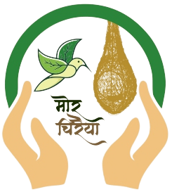

  

<h1 align="center">
  Mor-Chiraiya
</h1>

This is the code base of [Mor-Chiraiya](https://mor-chiraiya.org/).

## Table of contents

- [Table of contents](#table-of-contents)
- [Overview](#overview)
  - [What is the project?](#what-is-the-project)
  - [When will the project be complete?](#when-will-the-project-be-complete)
  - [Links](#links)
- [My process](#my-process)
  - [Built with](#built-with)

## Overview

### What is the project?

This is a client project, where i was asked to design and develop a bilingual website promoting a campaign called Mor-Chiraiya by Mahasamund Forest Division for sparrow conservation.

### When will the project be complete?

The MVP of the project is done by 4 Mar 2022. First commit was on 2 Mar 2022.

### Links

-   Website: [Link to Deployment](https://mor-chiraiya.org/)

## My process

I have used Gatsby JS, a frontend framework built on React JS. My choice was due to it's ability to render static pages with React Code which increases the maintainability. I also has a wide range of plugins supporting various different workflows. Due to this, i was able to include brotli compression as part of the static page generation. This reduced the load significantly.

### Built with

-   Gatsby
-   ReactJS
-   JSX
-   Tailwind CSS
-   Brotli Compression

Designed and Developed by [Jaideep Guntupalli](https://jaideepguntupalli.com)
